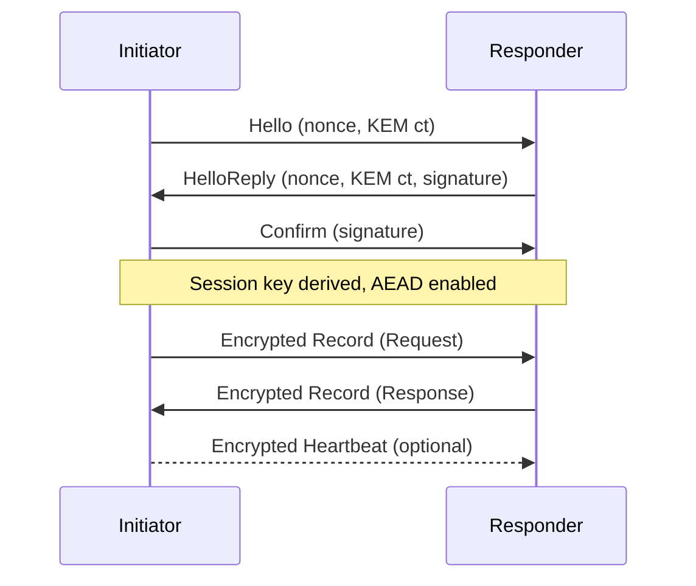

# QL Protocol (v2)

QL is a compact, session-oriented protocol for authenticated and encrypted messaging
between peers over arbitrary transports. It targets low-bandwidth and high-latency
links while preserving strong cryptography, explicit request/response semantics, and
a clean developer-facing API.

This crate (`ql`) implements the protocol stack: wire format, crypto, runtime state
machine, and routing. For a deeper comparison with v1, see `ql-protocol-v2.md`.

## features
- Fixed CBOR wire format: `QlRecord` = `[tag, header, payload]`.
- Mutual-auth handshake (`Hello`, `HelloReply`, `Confirm`) with signed transcript.
- Session keys derived from KEM secrets; payloads use AEAD (ChaCha20-Poly1305).
- Sessions are ephemeral and scoped to a handshake; no long-lived symmetric keys.
- First-contact pairing request with KEM-wrapped payloads and proof signature.
- Encrypted messages with explicit `Request`, `Response`, `Event`, and `Nack`.
- `MessageId`, `RouteId`, and `valid_until` for routing and freshness.
- Heartbeats for keepalive and disconnect detection.
- Runtime state machine for sessions, timeouts, outbound queues, and correlation.
- Router for typed dispatch and automatic response wiring.
- Transport abstraction via `QlPlatform` for BLE, TCP, or other links.

## overview
QL provides a full session protocol rather than isolated message sealing. It covers:
- Mutual authentication and end-to-end encryption above the transport.
- First-contact pairing for provisioning keys and establishing trust.
- Typed routing with explicit request/response/event semantics.
- Runtime lifecycle management (handshake, keepalive, timeouts, errors).
- Portability across transports via a minimal platform abstraction.

### security
- Mutual authentication via a signed handshake transcript.
- Session keys derived from KEM secrets; payloads are protected with AEAD
  and header AAD.
- End-to-end protection above the transport layer; pairing supports first-contact
  key exchange and proof of key possession.
- Message freshness enforced via `valid_until`; replay caching is not built-in,
  so applications can optionally track `MessageId` if needed.

### session vs per-message sealing
- v1 (gstp + envelope) signs every message and then encrypts it to the recipient.
  each message uses fresh encapsulation, so keys and signatures are per-message.
- v2 (ql) signs the handshake transcript once, derives a session key, then uses
  AEAD for each message with the header as AAD.
- encryption strength uses the same primitive (ChaCha20-Poly1305). post-quantum
  security depends on key schemes (ML-KEM + ML-DSA with `pqcrypto` enabled).
- tradeoffs: v2 is faster and smaller; v1 has per-message signature and key
  isolation. v2's AEAD provides in-session integrity but is not publicly
  verifiable and has a larger blast radius if a session key leaks.

### performance
- Public-key operations are paid once per session; steady-state traffic is
  symmetric AEAD.
- Compact CBOR record framing keeps headers and serialization overhead small.
- Optional heartbeats provide liveness detection without heavy traffic.

### developer experience
- Typed routes via `RequestResponse` and `Event` traits with explicit `RouteId`.
- Router handles decode, dispatch, and response wiring automatically.
- Runtime manages sessions, timeouts, outbound queues, and request correlation.
- `QlPlatform` abstracts the transport for portability and testability.

## message sizes
Sizes below are CBOR record sizes from `protocol_record_size_breakdown` in
`ql/src/tests/mod.rs`.

| Record | Size (bytes) |
| :-- | --: |
| Handshake Hello | 132 |
| Handshake HelloReply | 2563 |
| Handshake Confirm | 2510 |
| Pair request | 4065 |
| Message (empty payload) | 199 |
| Heartbeat | 196 |

Handshake total is 5205 bytes (132 + 2563 + 2510). At 20 kBps transport
throughput, raw transmit time is about 0.26 s.

## protocol overview

### record framing
All traffic is encoded as a `QlRecord` with a small, fixed shape:
- `tag` selects the payload type (handshake, pair, record, heartbeat).
- `header` is unencrypted but authenticated data (AEAD AAD) used for routing
  (sender and recipient XIDs).
- `payload` is a CBOR-encoded handshake/pair body or an encrypted message.

### handshake
The handshake is a three-message exchange:
- `Hello`: initiator sends a nonce and KEM ciphertext.
- `HelloReply`: responder returns its nonce, KEM ciphertext, and a signature
  over the transcript.
- `Confirm`: initiator signs the transcript to confirm mutual authentication.

Both sides derive the session key from the KEM secrets and transcript digest.
After the handshake, all records use symmetric AEAD with the header as AAD.

### pairing (first-contact)
Pairing is a standalone request that KEM-encrypts a payload containing:
- a `MessageId` and `valid_until` timestamp
- the sender's signing and encapsulation public keys
- a proof signature binding those keys

This enables establishing trust without an existing session.

### message records
Steady-state messages are sent as encrypted records with a typed body:
- `MessageKind`: `Request`, `Response`, `Event`, or `Nack`
- `MessageId`, `RouteId`, `valid_until`, and CBOR payload

Nacks communicate standard failure reasons (unknown route, invalid payload,
expired) so peers can recover consistently.

### heartbeats
Heartbeats are lightweight encrypted records used by the runtime to maintain
session liveness and detect disconnects.

### routing and dispatch
`RouteId` maps to concrete request/response or event types. The router decodes
payloads, dispatches handlers, and ensures each request receives a response or
a `Nack`.

### sequence diagram

## code map
- Wire format: `ql/src/wire/*`
- Cryptography: `ql/src/crypto/*`
- Runtime state machine: `ql/src/runtime/*`
- Routing and traits: `ql/src/router.rs`, `ql/src/lib.rs`
- Transport abstraction: `ql/src/platform.rs`
