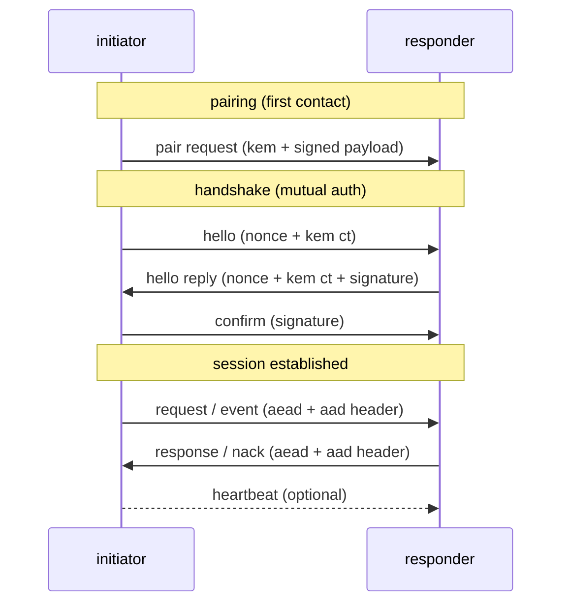

---
theme:
  name: gruvbox-dark
---

# quantumlink protocol v2
post-quantum, session-based message protocol

<!-- end_slide -->

# ql v1: constraints
- no message_id or sequence id
- no protocol-level request/response pairing
- each platform had to interpret + correlate by hand
- no ack/nack
- no notion of 'liveness'/'connected' status
- 6KB minimum message size
- more a utility crate than a protocol

<!-- end_slide -->

# v1 vs v2
<!-- column_layout: [1, 1] -->

<!-- column: 0 -->

## v1
- gstp sealed envelope per message
- per-message sign+encrypt (envelope)
- implicit req/resp in enum variants
- app-owned pairing, timeouts, keepalive, connected status

<!-- column: 1 -->

## v2
- compact record + typed payloads
- handshake signatures + per‑message aead under symmetric session key
- explicit kind + ids + nack
- runtime handles pairing, timeouts, keepalive, connected status, request/response matching

<!-- end_slide -->

# design shift: per-message -> session
- v1 sealed each message
- v2 signs once, then aead per message
- aead = authenticated encryption with associated data
- encrypts payload + integrity tag (chacha20-poly1305)
- aad = additional authenticated data
- visible header, integrity-protected (not encrypted)

```text
v1: seal(msg) = sign(msg) + encrypt(recipient)
v2: session_key = handshake()
v2: aead(msg, aad=header)
```

<!-- end_slide -->

# configurable host platform
- same runtime across keyos / mobile / desktop
- host supplies pq keys, io, timers, callbacks

```rust
pub trait QlPlatform {
    // pq identity
    fn signing_private_key(&self) -> &MLDSAPrivateKey;
    fn signing_public_key(&self) -> &MLDSAPublicKey;
    fn encapsulation_private_key(&self) -> &MLKEMPrivateKey;
    fn encapsulation_public_key(&self) -> &MLKEMPublicKey;

    // transport + runtime hooks
    fn fill_bytes(&self, data: &mut [u8]);
    fn write_message(&self, message: Vec<u8>) -> PlatformFuture<'_, Result<(), QlError>>;
    fn sleep(&self, duration: Duration) -> PlatformFuture<'_, ()>;

    // event handlers
    fn handle_peer_status(&self, peer: XID, session: &PeerSession);
    fn handle_inbound(&self, event: HandlerEvent);
}
```

<!-- end_slide -->

# multi-peer runtime
- runtime tracks sessions per peer
- concurrent handshakes + keepalive per peer

```rust
handle.register_peer(peer, signing_key, encapsulation_key);
handle.connect(peer)?;
```

<!-- end_slide -->

# protocol breakdown


<!-- end_slide -->

# wire framing: routable header
- record = [tag, header, payload]
- header is unencrypted but authenticated (aad)

```rust
pub struct QlRecord {
    pub header: QlHeader,
    pub payload: QlPayload,
}

pub struct QlHeader {
    pub sender: XID,
    pub recipient: XID,
}
```

<!-- end_slide -->

# handshake flow + records
- hello: nonce + mlkem ciphertext
- reply: nonce + mlkem ciphertext + mldsa signature
- confirm: mldsa signature, then session key

```rust
pub struct Hello {
    pub nonce: Nonce,
    pub kem_ct: MLKEMCiphertext,
}

pub struct HelloReply {
    pub nonce: Nonce,
    pub kem_ct: MLKEMCiphertext,
    pub signature: MLDSASignature,
}

pub struct Confirm {
    pub signature: MLDSASignature,
}
```

<!-- end_slide -->

# session key derivation
- transcript binds ids + nonces + kem ciphertexts
- session key = digest(initiator_secret, responder_secret, transcript)

```rust
let transcript = cbor([
    initiator, responder,
    hello.nonce, reply.nonce,
    hello.kem_ct, reply.kem_ct,
]);
let payload = cbor([initiator_secret, responder_secret, transcript]);
let digest = Digest::from_image(payload);
let session_key = SymmetricKey::from_data(*digest.data());
```

<!-- end_slide -->

# message modalities
- request / response
- event: fire-and-forget or acked
- nack for structured failure

```rust
pub enum MessageKind {
    Request,
    Response,
    Event,
    Nack,
}
```

<!-- end_slide -->

# message body: routing + expiry
- message_id + route_id
- valid_until for freshness

```rust
pub struct MessageBody {
    pub message_id: MessageId,
    pub valid_until: u64,
    pub kind: MessageKind,
    pub route_id: RouteId,
    pub payload: CBOR,
}
```

<!-- end_slide -->

# nack reasons
- unknown route / invalid payload / expired

```rust
pub enum Nack {
    Unknown,
    UnknownRoute,
    InvalidPayload,
    Expired,
}
```

<!-- end_slide -->

# type-safe routing
- route id is const per type
- compiler couples request -> response

```rust
pub trait RequestResponse: QlCodec {
    const ID: RouteId;
    type Response: QlCodec;
}

pub trait Event: QlCodec {
    const ID: RouteId;
}
```

<!-- end_slide -->

# router wiring
- builder ties route ids to handlers
- unknown routes auto-nack

```rust
let router = Router::builder()
    .add_request_handler::<Ping>()
    .add_event_handler::<Status>()
    .build(state);
```

<!-- end_slide -->

# runtime api flow
- request returns response or nack
- events are fire-and-forget (or acked)

```rust
let reply = handle.request(msg, peer, RequestConfig::default()).await?;
handle.send_event(status, peer);
```

<!-- end_slide -->

# performance snapshot (cbor sizes)
| proto | message | bytes | notes |
| :-- | :-- | --: | :-- |
| v1 | sealed msg (exchange_rate) | 6645 | sign+encrypt |
| v1 | sealed heartbeat | 6633 | sign+encrypt |
| v2 | hello | 132 | kem+nonce |
| v2 | hello reply | 2563 | sig+kem |
| v2 | confirm | 2510 | sig |
| v2 | pair request | 4065 | sig+kem |
| v2 | message (empty) | 199 | steady-state |
| v2 | heartbeat | 196 | steady-state |

handshake total: 5205 bytes

<!-- end_slide -->

# close
- smaller packets, clearer flow, typed api
- ql v2 is the protocol, not just a crate
