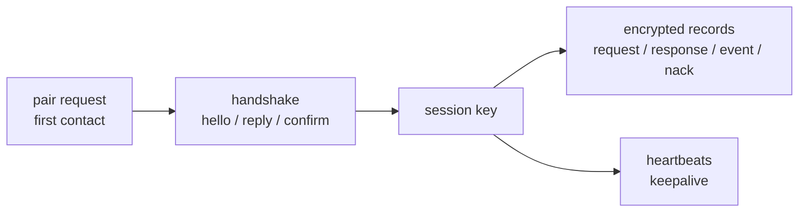

# ql v2: quantumlink protocol
small, session-oriented api for quantumlink v2

<!-- end_slide -->

# ql v1: constraints
- no message_id or sequence id
- no request/response or subscriptions
- manual matching on one big enum
- no ack/nack

<!-- end_slide -->

# design shift: per-message -> session
- v1 sealed each message
- v2 signs once, then aead per message

```text
v1: seal(msg) = sign(msg) + encrypt(recipient)
v2: handshake() -> session_key
    aead(msg, aad=header)
```

<!-- end_slide -->

# multi-peer runtime
- runtime tracks sessions per peer
- concurrent handshakes + keepalive per peer

```rust
handle.register_peer(peer, signing_key, encapsulation_key);
handle.connect(peer)?;
```

<!-- end_slide -->

# protocol breakdown


<!-- end_slide -->

# wire framing: routable header
- record = [tag, header, payload]
- header is unencrypted but authenticated (aad)

```rust
pub struct QlRecord {
    pub header: QlHeader,
    pub payload: QlPayload,
}

pub struct QlHeader {
    pub sender: XID,
    pub recipient: XID,
}
```

<!-- end_slide -->

# handshake flow
- hello: nonce + kem ciphertext
- reply: nonce + kem ciphertext + signature
- confirm: signature, then session key

<!-- end_slide -->

# handshake records (from `ql/src/wire/handshake.rs`)
```rust
pub struct Hello {
    pub nonce: Nonce,
    pub kem_ct: EncapsulationCiphertext,
}

pub struct HelloReply {
    pub nonce: Nonce,
    pub kem_ct: EncapsulationCiphertext,
    pub signature: Signature,
}

pub struct Confirm {
    pub signature: Signature,
}
```

<!-- end_slide -->

# session key derivation
- kem secrets + transcript digest
- same symmetric primitive for all records

```rust
let payload = cbor([initiator_secret, responder_secret, transcript]);
let digest = Digest::from_image(payload);
let session_key = SymmetricKey::from_data(*digest.data());
```

<!-- end_slide -->

# message modalities
- request / response
- event / ack (null)
- nack for structured failure

```rust
pub enum MessageKind {
    Request,
    Response,
    Event,
    Nack,
}
```

<!-- end_slide -->

# message body: routing + expiry
- message_id + route_id
- valid_until for freshness

```rust
pub struct MessageBody {
    pub message_id: MessageId,
    pub valid_until: u64,
    pub kind: MessageKind,
    pub route_id: RouteId,
    pub payload: CBOR,
}
```

<!-- end_slide -->

# nack reasons
- unknown route / invalid payload / expired

```rust
pub enum Nack {
    Unknown,
    UnknownRoute,
    InvalidPayload,
    Expired,
}
```

<!-- end_slide -->

# type-safe routing
- route id is const per type
- compiler couples request -> response

```rust
pub trait RequestResponse: QlCodec {
    const ID: RouteId;
    type Response: QlCodec;
}

pub trait Event: QlCodec {
    const ID: RouteId;
}
```

<!-- end_slide -->

# router wiring
- builder ties route ids to handlers
- unknown routes auto-nack

```rust
let router = Router::builder()
    .add_request_handler::<Ping>()
    .add_event_handler::<Status>()
    .build(state);
```

<!-- end_slide -->

# runtime api flow
- request returns response or nack
- events are fire-and-forget (or acked)

```rust
let reply = handle.request(msg, peer, RequestConfig::default()).await?;
handle.send_event(status, peer);
```

<!-- end_slide -->

# security model shift
- v1: per-message signature + encryption (gstp + envelope)
- v2: handshake signatures + session aead
- same aead (chacha20-poly1305), pq via ml-kem + ml-dsa
- tradeoff: per-message isolation vs session speed

<!-- end_slide -->

# performance snapshot (cbor sizes)
| protocol | message type | size (bytes) | notes |
| :-- | :-- | --: | :-- |
| v1 | sealed message (exchange_rate) | 6645 | per-message envelope (sign + encrypt) |
| v1 | sealed heartbeat | 6633 | per-message envelope (sign + encrypt) |
| v2 | handshake hello | 132 | kem ciphertext + nonce |
| v2 | handshake hello reply | 2563 | signature + kem ciphertext |
| v2 | handshake confirm | 2510 | signature only |
| v2 | pair request | 4065 | signed payload + kem-wrapped body |
| v2 | message (empty payload) | 199 | steady-state record |
| v2 | heartbeat | 196 | steady-state record |

handshake total: 5205 bytes

<!-- end_slide -->

# close
- smaller packets, clearer flow, typed api
- ql v2 is the protocol, not just a crate
